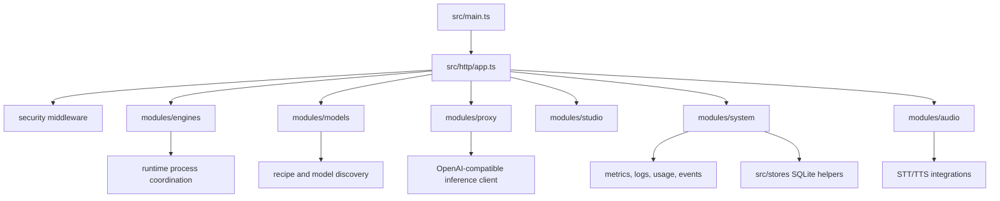

# Controller

`controller/` is the Bun/Hono backend for vLLM Studio. It exposes the HTTP API that the frontend, desktop app, and CLI use to manage models, proxy inference requests, read runtime status, and inspect usage/system data.

## What It Does

- Launches and evicts model-serving runtimes through recipes.
- Proxies OpenAI-compatible model, chat, audio, and tokenization requests.
- Streams controller/runtime events over SSE.
- Tracks GPU/system status, logs, downloads, usage, controller settings, and persisted runtime state.
- Provides Swagger/OpenAPI documentation for the controller API.

## What Is In Use

- Bun runtime.
- Hono HTTP framework.
- Zod configuration validation.
- SQLite-backed local stores.
- `prom-client` metrics.
- Swagger UI from `@hono/swagger-ui`.

## Architecture



## Prerequisites

- Bun 1.x.
- Optional NVIDIA/CUDA stack for local GPU model serving.
- Optional Docker/Compose infrastructure depending on deployment mode.

## Common Commands

```bash
bun install
bun src/main.ts
bun --watch src/main.ts
bun run typecheck
bun run lint
bun run check
```

## API Entry Points

- `GET /health`
- `GET /status`
- `GET /gpus`
- `GET /api/spec`
- `GET /api/docs`
- `GET /v1/models`
- `POST /v1/chat/completions`
- `GET /v1/studio/models`
- `GET /studio/downloads`

Route registration starts in `src/http/app.ts`.

## Configuration

Configuration parsing lives in `src/config/env.ts`. Runtime state is stored under the configured data directory; when running from `controller/`, the default data path resolves to the repo-level `data/` directory.

Use `.env.local` for machine-specific secrets and deployment values.

## Where To Look

- `src/main.ts`: server boot.
- `src/app-context.ts`: shared controller dependencies.
- `src/http/app.ts`: HTTP app and route mounting.
- `src/modules/engines/`: lifecycle, recipes, downloads, runtime process management.
- `src/modules/proxy/`: OpenAI-compatible proxy and inference accounting.
- `src/modules/system/`: metrics, logs, usage, events, and platform state.
- `src/stores/`: SQLite helpers and persisted stores.
